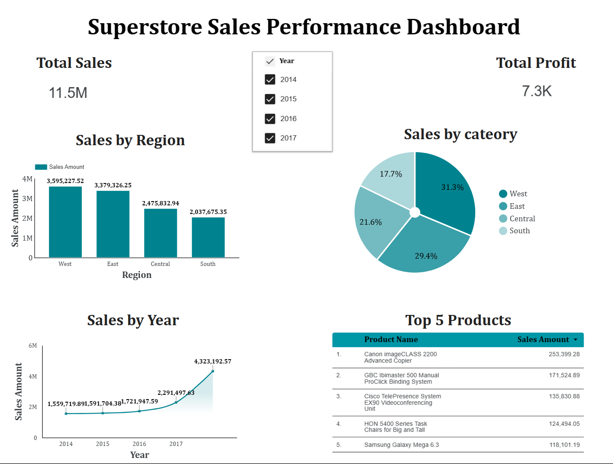

# 🛒 Superstore Sales Performance Dashboard

This project presents an interactive **Looker Studio dashboard** analyzing *Superstore Sales Performance* from 2014 to 2017.  
It highlights total sales, profits, regional trends, and product-level performance using clean visual insights.

---

## 📊 Dashboard Overview

**Dashboard Link:** https://lookerstudio.google.com/reporting/01f80040-54b3-4f20-8900-88decd4594c1

**Key Metrics:**
- 🧾 **Total Sales:** 11.5M  
- 💰 **Total Profit:** 7.3K  

---

## 📈 Visuals Included

1. **Sales by Region:**  
   - West region leads with the highest sales (~3.6M), followed by East and Central.  
2. **Sales by Year:**  
   - Steady growth from 2014 to 2017, peaking at 4.3M in 2017.  
3. **Sales by Category (Pie Chart):**  
   - West: 31.3%  
   - East: 29.4%  
   - Central: 21.6%  
   - South: 17.7%  
4. **Top 5 Products by Sales:**  
   - Canon imageCLASS 2200 Advanced Copier  
   - GBC Ibimaster 500 ProClick Binding System  
   - Cisco TelePresence System EX90  
   - HON 5400 Series Task Chairs  
   - Samsung Galaxy Mega 6.3  

---

## 🧰 Tools & Technologies

- **Google Looker Studio** – for building the dashboard  
- **Google Sheets** – as the data source  
- **Sample Superstore Dataset** – for sales data  
- **GitHub** – for version control and documentation  

---

## 💡 Key Insights

- The **West Region** generated the highest overall sales.  
- Sales and profits show consistent **growth over the years**.  
- The **Technology category** contributes most to total revenue.  
- Top-selling products indicate strong performance in office and tech equipment.

---

## 🖼 Dashboard Preview

---

## 📚 About

This project demonstrates analytical storytelling using **data visualization** and **Google Cloud tools**.  
It’s designed for beginner-to-intermediate data analysts exploring dashboard creation and performance insights.

---

👩‍💻 **Created by:** Amisha Gawai  
📅 **Year:** 2025  
📌 *Data Visualization | Google Looker Studio | Analytics Portfolio Project*
